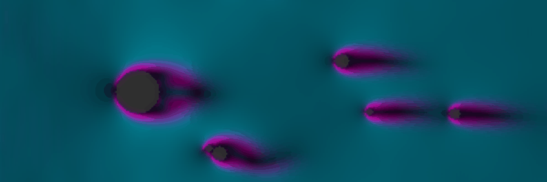

  

<table width="100%" style="background-color: #0d1117; border: 1px solid #30363d; font-family: monospace;">
    <tr>
        <td width="60%" valign="top" style="padding: 20px;">
            

                >> PROJECT: AETHER //
            

            

                > SIMULATION: LATTICE BOLTZMANN (D2Q9) 
                > STATE: TURBULENT FLOW 
                > DRIVER: NUMPY PHYSICS KERNEL
            

        </td>
        <td width="40%" valign="top" align="right" style="padding: 20px; border-left: 1px solid #30363d;">
            

                [FLUID LAB]
            

            

                REYNOLDS NUMBER: 4000+ 
                RESOLUTION: 900x300 
                COMPUTE: CPU/VECTORIZED
            

        </td>
    </tr>
</table>

    <!-- Control Panel / Metrics -->
    <table width="100%">
        <tr>
             <td align="center">
                &nu; = 0.02 
                KINEMATIC VISCOSITY
             </td>
             <td align="center" style="border-left: 1px solid #30363d; border-right: 1px solid #30363d;">
                &nabla; &times; u 
                CURL / VORTICITY
             </td>
             <td align="center">
                60 Hz 
                REFRESH RATE
             </td>
        </tr>
    </table>

    GENERATED BY AETHER ENGINE // <a href="https://github.com/nbharath1306/nbharath1306" style="color: #58a6ff; text-decoration: none;">ACCESS_LAB()</a>

