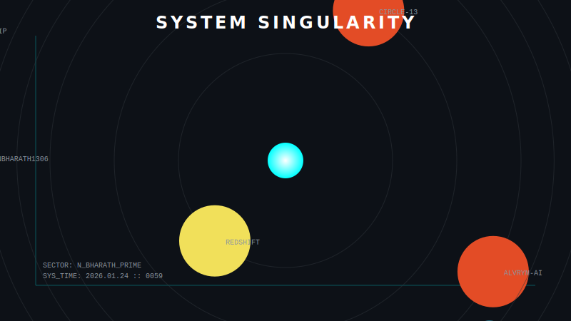

  <!-- Header Section -->
  
  
    

  <table width="100%" style="border: 1px solid #30363d; background-color: #0d1117;">
    <tr>
      <td width="55%" valign="top" style="padding: 20px;">
        <h2 style="font-family: monospace; color: white;">>> N_BHARATH</h2>
        <h4 style="font-family: monospace; color: #8b949e;">// SYSTEM ARCHITECT & FULL STACK DEVELOPER</h4>
         
        <code style="color: #00ffff; display: block; background: #000000; padding: 15px; border-left: 3px solid #00ffff;">
          > INITIALIZING PROFILE PROTOCOLS... 
          > SUBJECT: BHARATH 
          > STATUS: ONLINE 
          > LOCATION: BANGALORE, INDIA 
          > MISSION: BUILDING SCALABLE SYSTEMS 
        </code>
         
        

          I architect digital solutions that bridge the gap between complex backend logic and intuitive frontend experiences. 
          Currently exploring the event horizon of AI agents and distributed systems.
        

      </td>
      <td width="45%" valign="top" style="padding: 20px; background-color: #161b22; border-left: 1px solid #30363d;">
        <h3 style="color: white; font-family: monospace;">// ACTIVE PROTOCOLS</h3>
        
        

            
            
        

        <h3 style="color: white; font-family: monospace;">// SYSTEM METRICS</h3>
        
      </td>
    </tr>
  </table>

   

  <!-- Tech Stack Section -->
  <table width="100%" style="border: 1px solid #30363d; background-color: #161b22;">
    <tr>
        <td style="padding: 20px;">
            <h3 style="color: #58a6ff; font-family: monospace;">// ARSENAL [LANGUAGES & TOOLS]</h3>
            

                  
                  
                  
                
            

        </td>
    </tr>
  </table>

   

  <!-- Stats & Activity Section -->
  <table width="100%" style="border: 0;">
    <tr>
        <td width="55%" valign="top">
            <h3 style="color: #58a6ff; font-family: monospace;">// CONTRIBUTION LOG</h3>
             
        </td>
        <td width="45%" valign="top">
            <!-- Optional: Use the unused asset or a visually interesting gif -->
            

                <h4 style="color: #8b949e; margin-top: 0;">// VISUAL DATA FEED</h4>
                
            

        </td>
    </tr>
  </table>

   
  
  

    
  
  

    SYSTEM STATUS: OPERATIONAL | END OF TRANSMISSION
  

