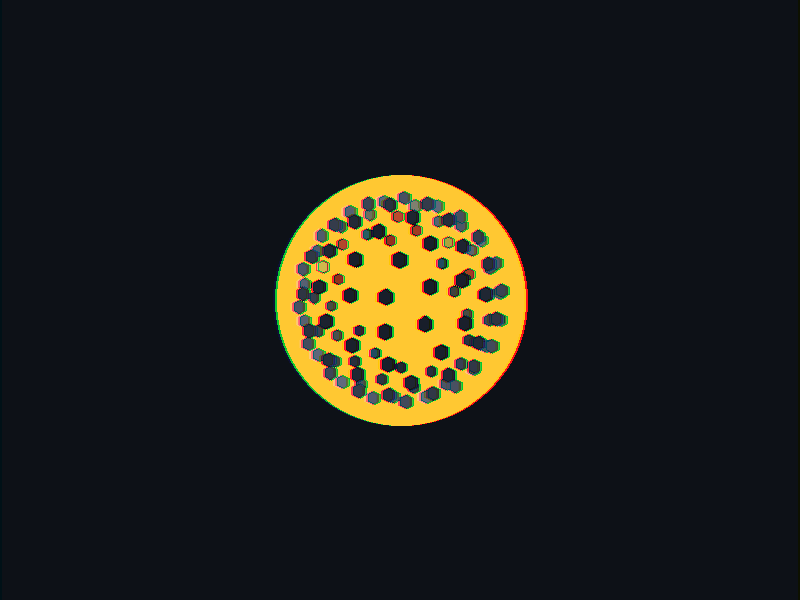

<!-- MEGA-STRUCTURE HOLOGRAM -->

 

<!-- COMMAND DECK HEADER -->
<table width="100%" style="background-color: #0d1117; border: 1px solid #30363d; font-family: 'Courier New', monospace;">
    <tr>
        <td align="left" style="padding: 12px; color: #FFD700; font-weight: bold;">
            🌟 DYSON SPHERE // COMMAND DECK
        </td>
        <td align="right" style="padding: 12px;">
            
            
        </td>
    </tr>
</table>

<!-- POWER METRICS -->
<table width="100%" style="background-color: #161b22; border: 1px solid #30363d; border-top: 0;">
    <tr>
        <td width="25%" align="center" style="padding: 15px; border-right: 1px solid #30363d;">
            
120

            
ORBITAL PANELS

        </td>
        <td width="25%" align="center" style="padding: 15px; border-right: 1px solid #30363d;">
            
∑ REPOS

            
ENERGY SOURCES

        </td>
        <td width="25%" align="center" style="padding: 15px; border-right: 1px solid #30363d;">
            
★ TW

            
POWER OUTPUT

        </td>
        <td width="25%" align="center" style="padding: 15px;">
            
60 Hz

            
REFRESH RATE

        </td>
    </tr>
</table>

<!-- SYSTEM INFO -->
<table width="100%" style="background-color: #0d1117; border: 1px solid #30363d; border-top: 0;">
    <tr>
        <td style="padding: 10px; font-size: 11px; color: #8b949e; font-family: monospace;">
            <strong style="color: #58a6ff;">// FIBONACCI DISTRIBUTION</strong> | 
            <strong style="color: #58a6ff;">FRESNEL RIM LIGHTING</strong> | 
            <strong style="color: #58a6ff;">CHROMATIC ABERRATION</strong>
        </td>
    </tr>
</table>

<!-- FOOTER -->

    RENDERED BY ORBITAL FORGE // <a href="https://github.com/nbharath1306" style="color: #58a6ff;">access_command_deck()</a>

