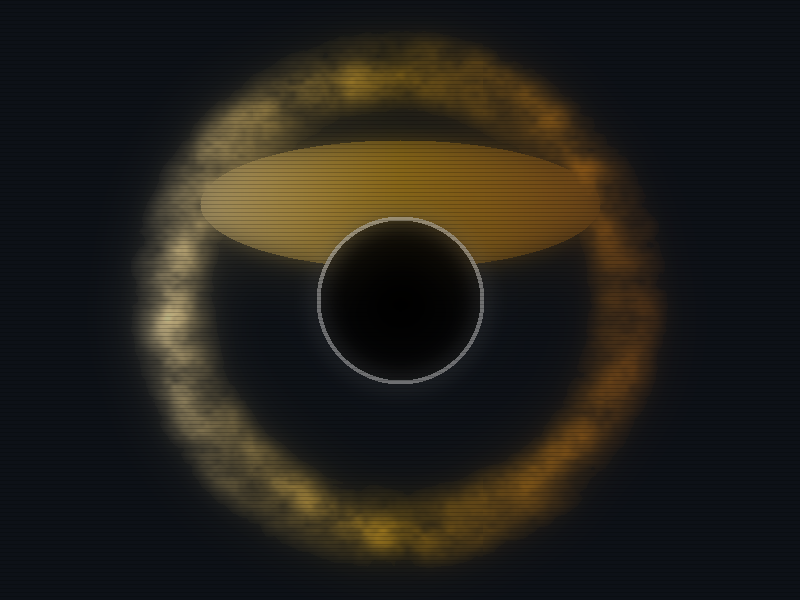

<!-- HERO VISUALIZATION -->

 

<!-- CONTROL CONSOLE -->
<table width="100%" style="background-color: #0d1117; border: 1px solid #30363d; font-family: 'Courier New', monospace; border-top: 0;">
    <tr>
        <!-- LEFT PANEL: TELEMETRY -->
        <td width="60%" valign="top" style="padding: 15px;">
            

                > SYSTEM: SINGULARITY //
            

            

                STATUS: STABLE 
                EVENT HORIZON: 80 AU 
                ACCRETION DISK: 280 AU 
                GRAVITATIONAL LENSING: ACTIVE
            

             
            

                [ ONLINE ] PHYSICS ENGINE 
                [ ONLINE ] VOLUMETRIC RAY MARCHER
            

        </td>
        
        <!-- RIGHT PANEL: INTERACTION -->
        <td width="40%" valign="top" align="center" style="padding: 15px; border-left: 1px solid #30363d; background-color: #161b22;">
            

                // COMMAND OVERRIDE
            

            
            
            
              
            
            

                CLICK TO DEPLOY ORBITAL DRONE 
                (TRIGGERS GITHUB ACTION)
            

        </td>
    </tr>
</table>

<!-- FOOTER -->

    RENDERED BY PROJECT SINGULARITY // PYTHON VOLUMETRIC ENGINE

