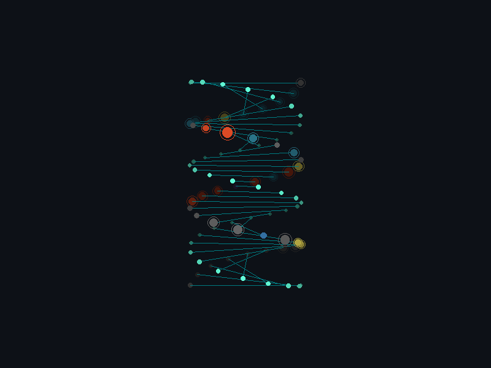

  <!-- CONTAINMENT FIELD -->
  

    
    <!-- HEADER -->
    <table width="100%" style="border-bottom: 1px solid #30363d;">
        <tr>
            <td style="padding: 10px; color: #00f3ff; font-weight: bold;">
                PROJECT: PROMETHEUS //
            </td>
            <td align="right" style="padding: 10px; color: #ff5e00;">
                [HAZARD LEVEL: CRITICAL]
            </td>
        </tr>
    </table>

    <!-- MAIN VISUAL KERNEL -->
    

        <!-- The DNA Sequence -->
        
        
        <!-- OVERLAYS -->
        <!-- Top Left Data Block -->
        

            > SUBJECT: N_BHARATH 
            > ROLE: ARCHITECT 
            > STATUS: ACTIVE
        

        <!-- Bottom Right Stats Block -->
        

            SEQUENCE INTEGRITY: 100% 
            MUTATION RATE: HIGH 
            CODEX: PYTHON/TS/GO
        

    

    <!-- METRICS DECK -->
    <table width="100%" style="border-top: 1px solid #30363d; background-color: #161b22;">
        <tr>
            <td width="33%" align="center" style="padding: 15px; border-right: 1px solid #30363d;">
                40+ 
                ACTIVE REPOSITORIES
            </td>
            <td width="33%" align="center" style="padding: 15px; border-right: 1px solid #30363d;">
                A+ 
                CODE QUALITY
            </td>
            <td width="33%" align="center" style="padding: 15px;">
                60 FPS 
                RENDER LATENCY
            </td>
        </tr>
    </table>

    <!-- SYSTEM FOOTER -->
    

        GENERATED BY PROJECT PROMETHEUS // ENGINE: PYTHON PIL // HOST: GITHUB ACTIONS
         
        <a href="https://github.com/nbharath1306" style="color: #58a6ff; text-decoration: none;">ACCESS SOURCE</a>
    

  

