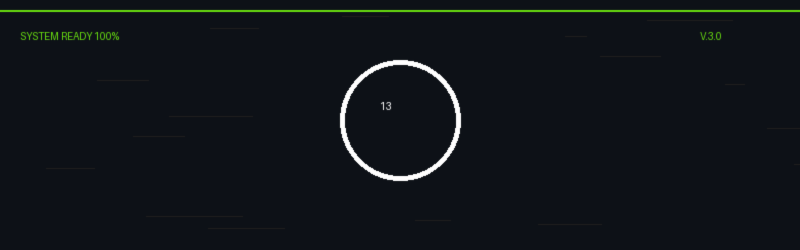

  

  

    

  <table width="100%" style="border: 0; background-color: #0d1117;">
    <tr>
      <td width="50%" valign="top" style="padding: 20px;">
        >> CREW_MANIFEST // V1.0  
        
        <h2 style="margin: 0; color: white;">N. BHARATH</h2>
        FOUNDER & CEO // COMMANDER
        
          
        
        

          They told us to wait for luck. 
          We told them <b style="color: white;">VOLUME NEGATES LUCK.</b> 
          An engine of chaos and creation.
        

        
         
        
        <a href="https://linkedin.com/in/n-bharath-2b86311b9/" style="text-decoration: none; color: #67DD10;">[ LINKEDIN ]</a> &nbsp;
        <a href="https://x.com/" style="text-decoration: none; color: #67DD10;">[ TWITTER ]</a>
      </td>

      <td width="50%" valign="top" style="padding: 20px; border-left: 1px solid #30363d;">
        >> SYSTEM_MODULES  
        
        <b style="color: #67DD10;">01 // AI AUTO</b> 
        Optimizing workflows through neural networks. 
        <code style="color: white; font-size: 10px;">STATUS: ACTIVE</code>
          
        
        <b style="color: #67DD10;">02 // SUMMIT</b> 
        Global community gathering protocol. 
        <code style="color: white; font-size: 10px;">STATUS: DEPLOYED</code>
          
        
        <b style="color: #67DD10;">03 // MICRO</b> 
        Rapid prototyping engine for market testing. 
        <code style="color: #30363d; font-size: 10px;">STATUS: CLASSIFIED</code>
      </td>
    </tr>
  </table>

  

    

      COORD: 13.00.00 // SIGNAL_STRENGTH: 100% // <a href="https://circle-13.vercel.app/" style="color: white; text-decoration: none;">[ ACCESS MAIN TERMINAL ↗ ]</a>
    

  

